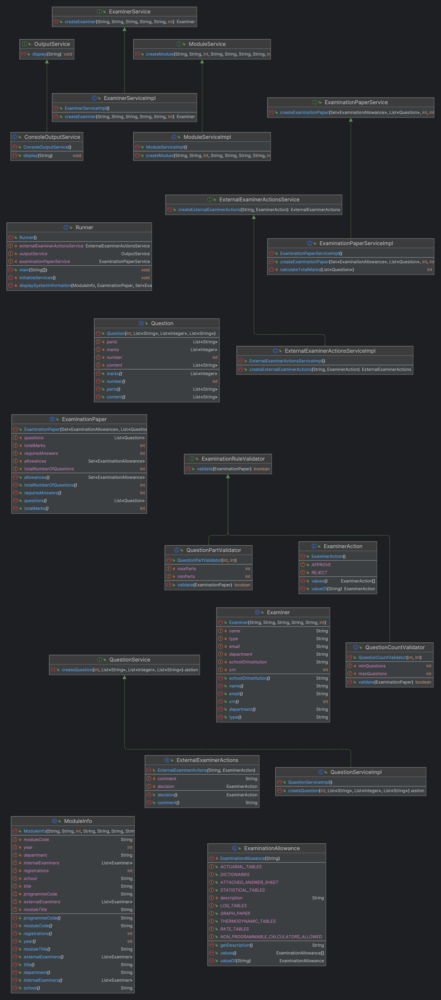

*ImmutableApiDesign:*

### Deployment and Delivery:
- The project is deployable via a single JAR file, `dop.jar`, executable from the command line.
- Adheres to the specified packaging structure, including source code, JAR file, README, and JavaDocs.

### UML Diagram:

### Documentation:
- JavaDocs are provided for all public types and methods.

**ExaminationPaper**

- **Purpose** : Represents examination papers, incorporating strict validation rules.
- **Design** : Immutable Java record, ensuring data consistency and integrity.

**Examiner**

- **Purpose** : Models details about internal and external examiners.
- **Design** : Implemented as a Java record with comprehensive validation for input fields like name, type, and email, ensuring all data is valid and consistent.

**ExternalExaminerActions**

- **Purpose** : Handles actions taken by external examiners, such as approval or rejection of examination papers.
- **Design** : Using enums for defining actions, this component integrates seamlessly with the rest of the system.

**ModuleInfo and Question**

- **Purpose** : Represents academic modules and individual examination questions.
- **Design** : Both designed as immutable records, ensuring clarity and consistency of data.

**Output Service Abstraction:**

**OutputService Interface**

- **Role** : Defines a contract for output display mechanisms.
- **Flexibility** : Allows for different implementations (e.g., console output, GUI output) without changing the main application logic.

**ConsoleOutputService**

- **Implementation** : A concrete implementation of **OutputService** that handles output to the console, demonstrating the application's adherence to the Dependency Inversion Principle.

**Service Interfaces and Implementations:**

**ExaminationPaperService and ExaminerService**

- **Functionality** : Provide services for creating **ExaminationPaper** and **Examiner** instances to specified business rules and validations.
- **Design Approach** : Interfaces are used to define contracts, allowing for flexible implementations and adherence to SOLID principles.

**ExternalExaminerActionsServiceImpl**

- **Functionality** : Implements the creation of **ExternalExaminerActions** , demonstrating the application of business logic in a modular fashion.

**Strategy Pattern Implementation for Examination Paper Validation:**

I have implemented the Strategy Pattern to provide a flexible and interchangeable way of validating examination papers. This pattern is crucial for maintaining and extending validation logic, allowing different validation strategies to be applied without modifying the core application logic.

**Strategy Pattern Usage:**

**ExaminationRuleValidator Interface**

- The **ExaminationRuleValidator** interface is the heart of our strategy pattern implementation. It defines a single method, **validate** , which takes an **ExaminationPaper** object as an input and returns a Boolean indicating whether the paper meets specific validation criteria.

**Concrete Validator Implementations**

- **QuestionCountValidator** : Validates that the number of questions in an examination paper falls within a specified range.
- **QuestionPartValidator** : Ensures each question has an appropriate number of parts.

**Integration in Application**

- The validators are instantiated and used in the **Runner** class.
- The examination paper is created and then passed to each validator.
- Each validator checks if the paper meets its specific criteria.
- If a paper does not pass a validation check, appropriate action is taken (e.g., printing an error message).

UML DIAGRAM not finished
